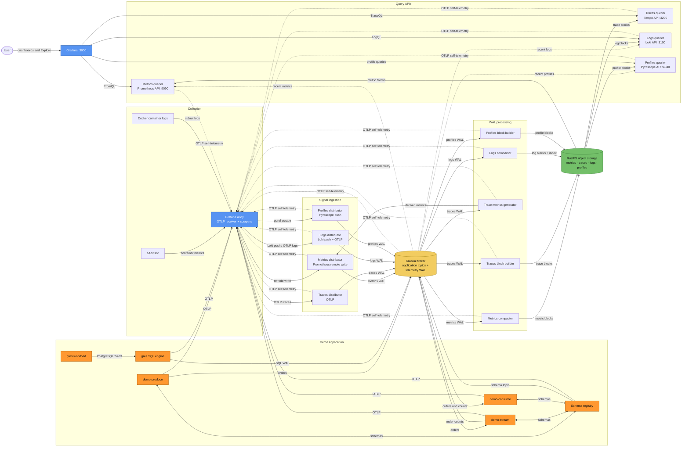

# Krabka observability demo architecture

The demo uses one Krabka broker for application events and as the write-ahead
log (WAL) for all four observability signals. Grafana Alloy receives or scrapes
telemetry, sends each signal to its distributor, and also collects telemetry
from the observability stack itself. Compactors and block builders move WAL data
into signal-specific RustFS buckets. Queriers combine recent WAL data with those
durable blocks for Grafana.

Solid arrows carry application data, telemetry, durable blocks, or queries.
Dotted arrows show hot-WAL reads and the self-observation loop. The init
containers (`broker-format`, `observability-topic-setup`, `topic-setup`, and
`rustfs-setup`) establish storage, buckets, and topics before the runtime paths
above start.
