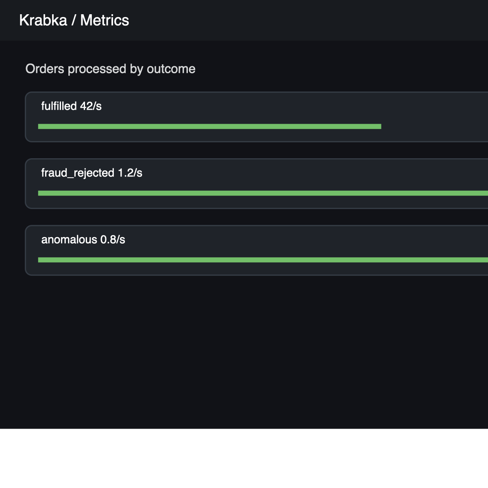
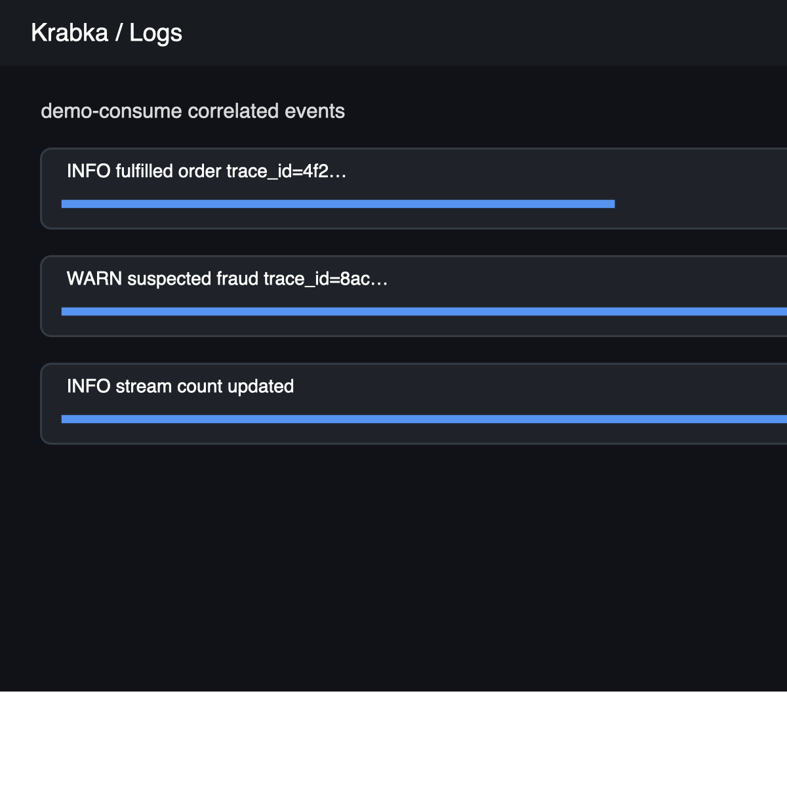
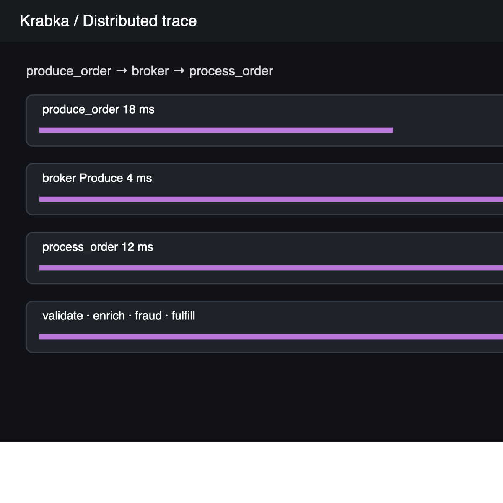
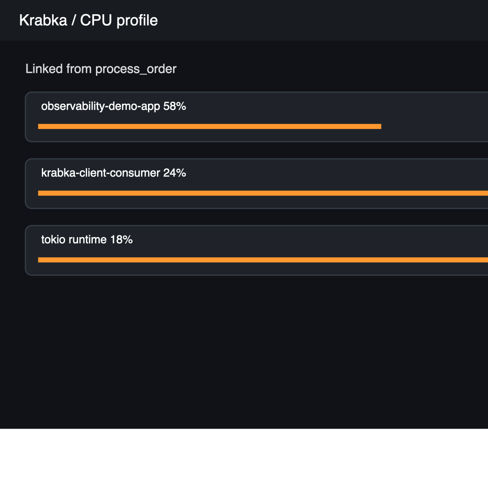

# Four-signal walkthrough

Start the stack with the commands in the [operator guide](operator-guide.md),
then open Grafana at <http://127.0.0.1:3000>.

1. Open **Krabka / Demo** and verify produced and processed order rates.
2. Open **Krabka / Orders Trace**, select a `produce_order` trace, and follow it
   through broker produce/fetch, `process_order`, and its four stage spans.
3. From the trace, follow the logs link and verify the same trace ID appears in
   the selected service logs.
4. Follow the profile link and inspect CPU samples around the selected span.
5. Open **Krabka / Service RED** to compare request rate, errors, and p95
   duration across services.
6. Run `./gres/workload.sh` and open **Krabka / Gres Traces** for the SQL
   session, statement, executor, and WAL path.

The expected views are shown below.

| Signal | Expected view |
|---|---|
| Metrics |  |
| Logs |  |
| Traces |  |
| Profiles |  |
